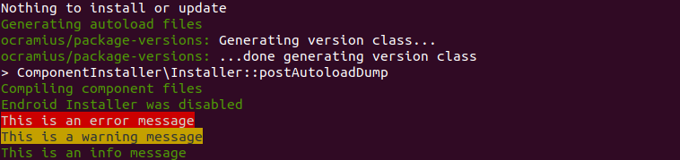

# Composer Message

*By [endroid](https://endroid.nl/)*

[](https://packagist.org/packages/endroid/composer-message)
[](https://github.com/endroid/composer-message/actions)
[](https://packagist.org/packages/endroid/composer-message)
[](https://packagist.org/packages/endroid/composer-message)
[](https://packagist.org/packages/endroid/composer-message)


## Installation

``` bash
$ composer require endroid/composer-message
```

## Usage

Define the messages inside your composer.json like this.

```
"extra": {
    "endroid": {
        "message": [
            { "content": "This is an error message", "type": "error" },
            { "content": "This is a warning message", "type": "warning" },
            { "content": "This is an info message", "type": "info" }
        ]
    }
}
```

This will generate the following console output during installation.



## Versioning

Version numbers follow the MAJOR.MINOR.PATCH scheme. Backwards compatible
changes will be kept to a minimum but be aware that these can occur. Lock
your dependencies for production and test your code when upgrading.

## License

This bundle is under the MIT license. For the full copyright and license
information please view the LICENSE file that was distributed with this source code.
